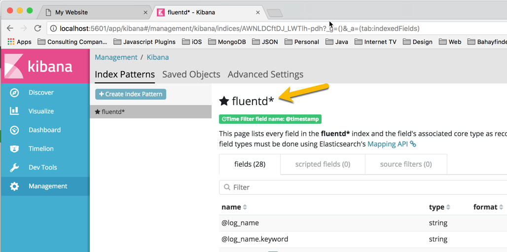

# Docker Environment
```
Version 18.05.0-ce-rc1-mac63 (24246)
Engine: 18.05.0-ce-rc1
Channel: edge
3b5a9a44cd
Compose: 1.21.0

Docker settings
4 CPU
6 GB RAM
1 GB Swap
```

# Pre-requisites
## 1. In docker-compose.yml, nginx service config, volume needs to binded to the host directory where the html files which nginx needs to serve is located  
```
volumes:
      - <directory of html files in the host>:/usr/share/nginx/html
```

# Run the containers using docker-compose. Make sure you are in the directory where the docker-compose.yml is located
```
cd challenge2
docker-compose up -d
```

You should see a similar output
```
Starting challenge2_elasticsearch_1 ... done
Starting challenge2_fluentd_1       ... done
Starting challenge2_kibana_1        ... done
Starting challenge2_nginx_1         ... done
```

# Check if ElasticSearch is running
```
http://localhost:9200
```

# Check if nginx is running
```
http://localhost
```

# Check if Kibana is running
```
http://localhost:5601
```

# Once Kibana is running, create an index pattern fluentd*




# Refresh the website so you can see logs sent by Fluentd from the nginx container in ElasticSearch using Kibana


# See logs in Kibana


    